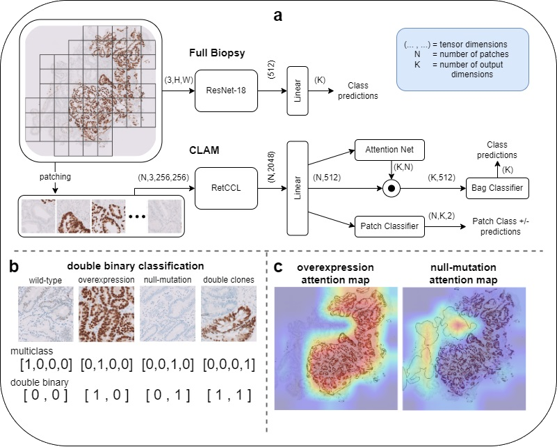

# Master Thesis Project: AI for Barret's Esophagus Dysplasia Detection

This project was done in collaboration with the Pathology department at Amsterdam UMC, location AMC, under supervision of Prof. Erik J. Bekkers, Michel Botros and Dr. Sybren Meijer. The goal was to use different AI model architectures for the task of detecting Barret's Esophagus (a precursor for Esophageal Cancer) lesions in microscopic scans of biopsies from the esophagus, stained with p53 immunohistochemistry.

The main model foundations used were CLAM and ResNet, with pretrained RetCCL used for feature extraction. I adapted the model architectures for double-binary classification, and added synthetic data to the dataset to improve the model's performance. The models were trained/tested on part of the LANS dataset and on the BOLERO dataset, which were provided to me by the Pathology department at AUMC.

<!-- Research summary image from images/summary.png: -->

In the above figure you can see an overview of the used full-biopsy and CLAM architectures in (a), the double-binary classification in (b), and CLAM attention maps in (c).

## Main files
- `vis_data.ipynb`: Visualize some aspects of the data like distribution
- `preprocess_latents.py`: Preprocess the png images into latents using RetCCL
- `resnet.py`: Train the ResNet model
- `pl_clam.py`: Train the CLAM model
- `vis_results.ipynb`: Load the trained models and test them on the test set and save them, then visualize the results in confusion matrices, ROC curves and such
- `vis_interpretability.ipynb`: Load the trained models and visualize the attention maps of the CLAM models and the other visualization methods for the ResNet models

## Model files
- `resnet.py`: Contains the ResNet model architecture implemented in PyTorch Lightning
- `pl_clam.py`: Contains the CLAM model architecture implemented in PyTorch Lightning
- `clam_model/clam_utils.py`: Contains a few utility functions for the CLAM model, including its attention nets
- `RetCCL/`: Contains the RetCCL architecture and the code to download its pretrained weights
- `load_data.py`: Contains various dataset classes, utils and transforms for loading the data
- `eval.py`: Contains the evaluation functions to use during PyTorch Lightning training

## Running the code
`requirements.txt` contains the necessary packages to run the code. However, I just used pip freeze -> requirements.txt, so it might contain more than necessary (sorry about that). Python 3.11.5 was used for this project.

### Only running to visualize results
In `minimum_data/results.zip` you can find the results of the trained models on the test set. Without any additional data, you can run the `vis_results.ipynb` notebook once you have the `results/` folder from the zip file set up at the path specified in the first notebook cell. This will load the predictions and generate the statistics and figures inside the notebook.

### Training the models
Before training, the code expects a data root directory `../../data` to be present, but this path can be changed at the top of `load_data.py`. In that root should be directories for each dataset (for example "LANS" and "BOLERO"). The main dataset (LANS in my case) should have the following structure:
- `biopsies/` containing the biopsy pngs, with names like "11_3.png" for the 11th slide and 3rd biopsy on that slide
- `train.csv` and `test.csv` containing the image names and labels like:
```
id,label
11_3,1
11_4,0
...
```
where 0 is Wild Type, 1 is Overexpression, 2 is Null Mutation and 3 is Double Clones.

For BOLERO, the `biopsies/` directory is also expected, but aside from that a labels file `P53_BOLERO_T.csv` with all pathologist ratings is expected in the form of:
```
Case ID,{pathologist id}, ... ,GS
{case id},{pathologist rating}, ... ,{gold standard label}
...
```
The CLAM models expect files with preprocessed latent vectors for each image (their path can be specified in the arguments of the `pl_clam.py` script) which can be generated using the `preprocess_latents.py` script.

### Folder structure
The folder structure can of course be changed by adjusting the paths in the code, but the following structure is expected by default:
```
code
├── {this repository, should be cwd when running scripts}
│   ├── {all files in this repository}
│
results (only necessary if visualizing existing results, can be found in minimum_data/results.zip)
├── CLAM
│   ├── {results for CLAM models .pt files}
│
├── {other model directories}
│
data (only necessary if training or evaluating models)
├── biopsies_s1.0_anon_new
│   ├── biopsies
│   │   ├── 0_0.png
│   │   ├── 0_1.png
│   │   ├── ...
│   │
│   ├── masks (optional)
│   │   ├── 0_0.png
│   │   ├── 0_1.png
│   │   ├── ...
│   │
│   ├── train.csv
│   ├── test.csv
│   ├── (latent vector files for CLAM models will be saved here)
│
├── BOLERO
│   ├── biopsies
│   │   ├── 0_0.png
│   │   ├── 0_1.png
│   │   ├── ...
│   │   
│   ├── P53_BOLERO_T.csv
│   ├── (latent vector files for CLAM models will be saved here)
│
models (only necessary if evaluating existing models)
├── CLAM
│   ├── {trained CLAM checkpoints}
│
├── {other model directories}
```